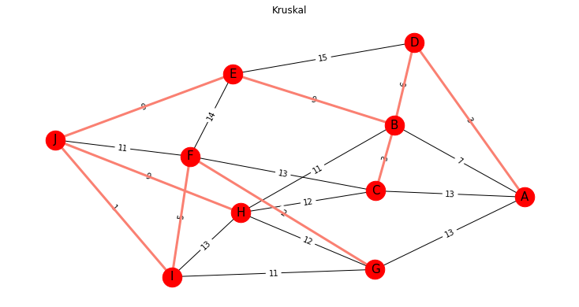

# **Kruskal's Minimum Spanning Tree (MST) Algorithm**  

A Python implementation of Kruskal's algorithm for finding the Minimum Spanning Tree in a weighted, undirected graph. Uses `NetworkX` for graph operations and `Matplotlib` for visualization.

## **Key Features**  
- Implements Kruskal's algorithm to find the MST  
- Generates random edge weights (1-15) for demonstration  
- Visualizes both original graph and MST in one plot (MST highlighted in red)  
- Python code with NetworkX and Matplotlib

## **Screenshot**  


## **Requirements**  
```bash
pip install networkx matplotlib
